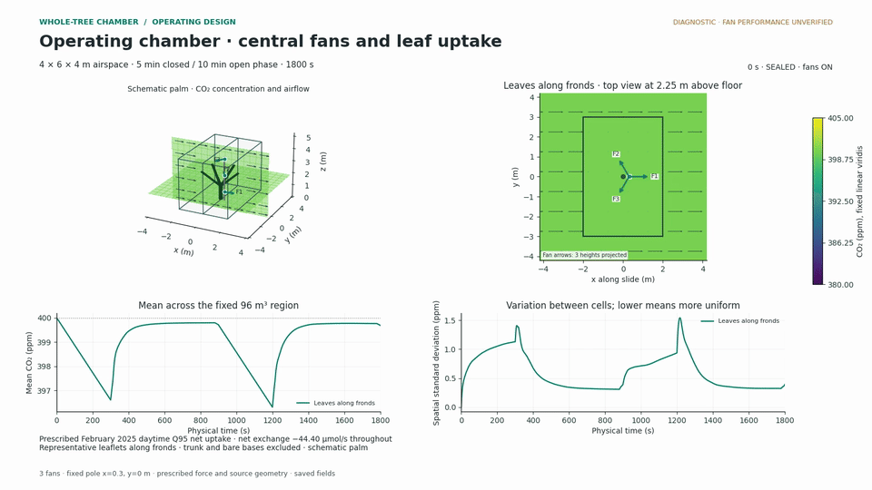

# Whole-tree chamber CFD

Simulate how CO₂ moves around an oil palm as a whole-tree chamber closes,
opens and exchanges air with its surroundings. External wind and internal fans
drive the airflow; a specified net gas-exchange rate removes or releases CO₂
at representative leaflets along the fronds.



The example uses a nominal **6 × 4 × 4 m chamber**, three central fans and a
**5-minute closed / 10-minute open-phase** cycle. Chamber dimensions, wind,
fan arrangement, plant size and net exchange are configurable.

## Explore the example

The [central-fan example](examples/central_fans/) includes the input file,
all four MP4/GIF views, 24 figures, time series and numerical checks.

| View | Video | Animation |
|---|---|---|
| Chamber CO₂ and airflow | [MP4](examples/central_fans/videos/cycle.mp4) | [GIF](examples/central_fans/videos/cycle.gif) |
| Airflow at the fan heights | [MP4](examples/central_fans/videos/fan_sections.mp4) | [GIF](examples/central_fans/videos/fan_sections.gif) |
| Concentration, exchange and operating cycle | [MP4](examples/central_fans/videos/operating_timeseries.mp4) | [GIF](examples/central_fans/videos/operating_timeseries.gif) |
| Leaflet exchange locations | [MP4](examples/central_fans/videos/leaf_source_location.mp4) | [GIF](examples/central_fans/videos/leaf_source_location.gif) |

## Run it

Use Python 3.12 and install FFmpeg, including `ffprobe`, on your PATH.
The dependency file pins the tested Python packages.

```bash
git clone https://github.com/adisapoetro/chamber-cfd.git
cd chamber-cfd
python3.12 -m venv .venv-operating
source .venv-operating/bin/activate
python -m pip install -r requirements-operating.lock
ffmpeg -version
ffprobe -version

# A short run to check the installation, including all four video views.
python scripts/operating_chamber.py all \
  --input examples/quick_start.yaml --output runs/quick_start

# Reproduce the 30-minute example and its numerical sensitivity checks.
python scripts/operating_chamber.py all \
  --input examples/central_fans/input.yaml --output runs/central_fans --workers 2
```

Choose a new output folder for each run. Open its `README.md` to find the
videos, figures, fields and checks. The short run tests the workflow; its
four seconds of simulated time are insufficient to assess chamber mixing.

The [running guide](docs/operating/REPRODUCING.md) covers installation,
individual workflow stages, resuming a run and using another flow model.

## Change the setup

Edit [current.yaml](configs/operating/current.yaml), copy an example input,
or override individual values at the command line:

```bash
python scripts/operating_chamber.py all \
  --input examples/central_fans/input.yaml \
  --set air.wind_speed_m_s=2 --set air.wind_to_deg=90 \
  --set fans.count=4 --set exchange.net_co2_umol_s=-30 \
  --set 'exchange.label=Constant net uptake: 30 micromol/s' \
  --output runs/four_fans
```

See [inputs and units](docs/operating/INPUTS.md) for chamber axes, fan heights,
flow directions, source conventions and numerical settings.

## Model and limitations

The Python solver uses conservative finite volumes on a moving mesh. It solves
incompressible airflow and CO₂ advection–diffusion, with momentum forcing for
fans and a distributed leaflet source. The [methods](docs/operating/METHOD.md)
explain the equations, boundary conditions and gas balance.

This is a diagnostic model. The example's nominal chamber dimensions and
installed fan performance still need field verification. Its constant
−44.4005 µmol/s source represents a February 2025 daytime Q95 net-uptake
case; it does not respond dynamically to light, temperature or CO₂.

Conservation checks pass, but the example's grid-sensitivity check exceeds
its 5% criterion: **5.83%** change in spatial standard deviation. The time-step
check passes. Opening-grid convergence has not been established.
See [verification](docs/operating/VERIFICATION.md) before interpreting the
flow patterns or comparing fan arrangements quantitatively.

[Result files explained](docs/operating/RESULTS.md) ·
[Example data and provenance](examples/central_fans/README.md#data-and-provenance)
