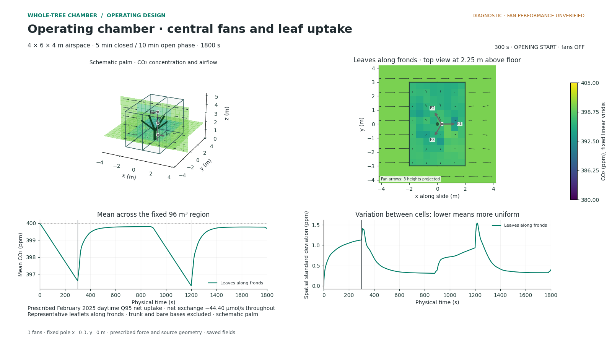

# Three central fans and leaflet CO₂ exchange

This example follows two operating cycles around a schematic oil palm.
CO₂ falls while the chamber is sealed and recovers toward the ambient
concentration as the halves slide open. Three fans circulate air during
closure; prescribed net uptake continues throughout the cycle.



## Setup

| Input | Value |
|---|---|
| Nominal chamber | 6 × 4 × 4 m; solver x × y × z = 4 × 6 × 4 m; 96 m³ |
| Palm envelope | 2.39 m tall, 1.52 m crown radius |
| External wind | 1.5 m/s toward +x |
| Ambient CO₂ | 400 ppm |
| Air temperature and pressure | 298.15 K, 101325 Pa |
| Cycle | 300 s sealed, then 600 s unsealed; two cycles |
| Opening and closing travel | 20 s each, included in the 600 s unsealed phase |
| Fans | Three Delta AFC1212DE; nominal 148.3 CFM per fan; closed only |
| Fan support | x = 0.30 m, y = 0 m relative to the trunk |
| Fan heights above the floor | 0.667, 2.000 and 3.333 m |
| Fan directions | 0°, 120° and 240°, measured counterclockwise from +x |
| Whole-tree net exchange | −44.40047791098563 µmol/s, constant |
| Exchange location | Representative leaflet surfaces along five fronds |
| Main numerical resolution | 0.5 m target cells; 0.5 s maximum time step |

[input.yaml](input.yaml) contains every input, including transport coefficients
and display settings. Dimensions and installed fan performance are assumptions
for this diagnostic. The source is a whole-tree net rate allocated by leaflet
area; it is not a dynamic leaf-photosynthesis calculation.

## Reproduce it

Follow the [installation instructions](../../docs/operating/REPRODUCING.md),
then run this command from the repository root:

```bash
python scripts/operating_chamber.py all \
  --input examples/central_fans/input.yaml \
  --output runs/central_fans --workers 2
```

Use a fresh output folder. The command runs the main calculation and two
first-closure sensitivity cases, then creates the media and numerical checks.
The run also saves the full spatial arrays and frozen source tree.

## Watch the results

| View | MP4 | GIF |
|---|---|---|
| Chamber CO₂ and airflow | [Video](videos/cycle.mp4) | [Animation](videos/cycle.gif) |
| Fan-height airflow sections | [Video](videos/fan_sections.mp4) | [Animation](videos/fan_sections.gif) |
| CO₂, exchange and operating schedule | [Video](videos/operating_timeseries.mp4) | [Animation](videos/operating_timeseries.gif) |
| Leaflet exchange locations | [Video](videos/leaf_source_location.mp4) | [Animation](videos/leaf_source_location.gif) |

The [figures folder](figures/) includes 24 PNGs: five physical timestamps for
each view, plus the fan layout, operating schedule, concentration history and
leaflet-source illustration. All images and videos use white backgrounds.
CO₂ views share a fixed linear viridis scale; the source-location view has
its own removal-rate scale.

After the first sealed interval, mean CO₂ is **396.605389 ppm**, consistent
with the imposed uptake and 96 m³ volume. Opening replenishes CO₂ while uptake
continues. The mean and spatial standard deviation describe the original
closed-chamber region, including while the shells move apart.

Conservation checks pass. The first-closure grid comparison changes spatial
standard deviation by **5.834%**, exceeding its 5% criterion; the smaller-time-step
comparison passes. These results illustrate the calculation and its limits.
They do not establish an optimal fan arrangement or validated mixing time.
See the [numerical checks](../../docs/operating/VERIFICATION.md).

## Data and provenance

The net-exchange input represents **Q95 uptake strength** among 188 February
2025 C2 daytime cycles, with measured global radiation **Rg ≥ 10 W/m²** and
no upper radiation limit. This is equivalent to Q05 of signed net exchange.
The example uses the resulting scalar as a constant throughout all phases.
It is not a daytime mean, gross photosynthesis or a current-year observation.

The original measurement records are not distributed here and are not needed
to run this fixed-input example. Reproducing the measurement selection itself
would require those records and their processing workflow.

| File | Contents |
|---|---|
| [input.yaml](input.yaml) | Complete reproducible input |
| [data/main_timeseries.csv](data/main_timeseries.csv) | Main-run history, 0–1800 s |
| [data/grid_timeseries.csv](data/grid_timeseries.csv) | Finer-grid history, 0–300 s |
| [data/dt_timeseries.csv](data/dt_timeseries.csv) | Smaller-time-step history, 0–300 s |
| [data/cases_summary.csv](data/cases_summary.csv) | Conservation, source and field checks by case |
| [data/numerical_sensitivity.csv](data/numerical_sensitivity.csv) | Resolution comparisons; changes are fractions, not percentages |
| [data/fan_configuration.csv](data/fan_configuration.csv) | Fan positions, heights and direction vectors |
| [checks.json](checks.json) | Full-run numerical and media check results |
| [provenance.json](provenance.json) | Environment, source hashes, input basis and numerical replay |
| [manifest.json](manifest.json) | SHA-256 hashes of every file in this example |

Histories use seconds, metres, ppm, m/s and µmol/s as indicated in their column
names. `roi_mean_ppm` and `roi_std_ppm` are volume-weighted statistics in the
fixed chamber region. `source_umol_s` is signed whole-tree net exchange;
`fans_on` is 1 while sealed and 0 otherwise. The
[results guide](../../docs/operating/RESULTS.md) explains the remaining outputs.

The repository includes all rendered media and the numerical histories.
Full spatial arrays, source snapshots and run logs are generated by the command
above. To verify the files supplied here, including decoding every media file:

```bash
python scripts/check_example.py --decode
```
