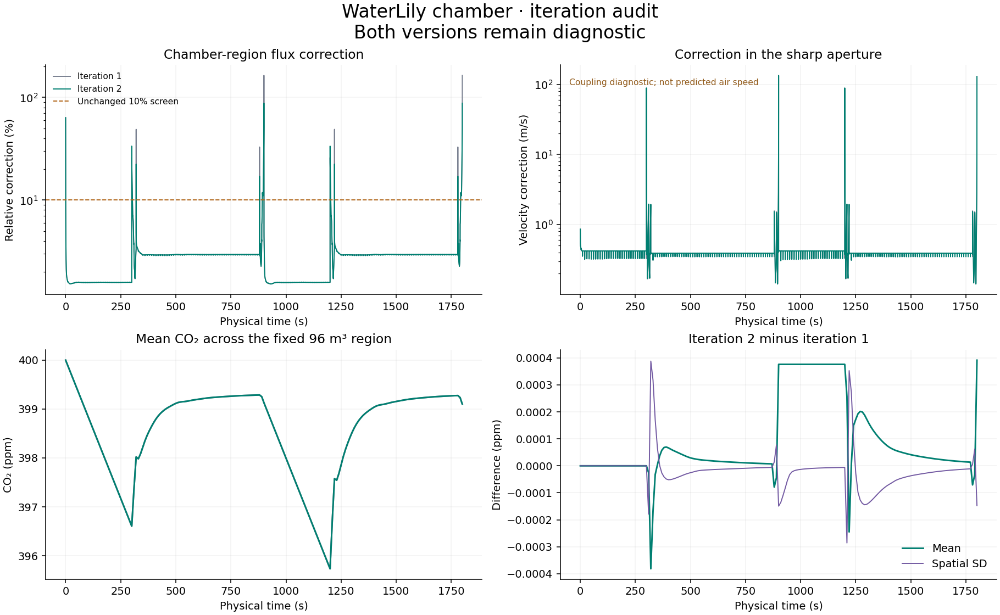

# Operating chamber: generated diagnostic

The complete 1,800 s WaterLily + Julia CO₂ run contains 181 saved times, covering
two cycles of 300 s sealed and 600 s unsealed. The fixed inside volume is 96 m³.
Prescribed net exchange is −44.40047791098563 µmol/s on representative leaflets,
including while open. Three central fans operate during closure.

The [repository example](../examples/current_chamber/README.md) contains all five
MP4/GIF views and 30 PNG stills, including the [large 3D view](../examples/current_chamber/videos/chamber_3d.mp4).
Full arrays and the frozen generating source
are in the local `results/current_chamber/` folder or can be regenerated using
the project README. Short checks are grouped under `results/diagnostics/`.

| Check | Result |
|---|---|
| Julia package tests | 337 assertions pass |
| Completed physical duration | 1,800 s |
| Saved concentration/velocity snapshots | 181 |
| Maximum geometric-law residual | 3.43 × 10⁻¹³ m³/s |
| Maximum cumulative CO₂ budget error | 6.88 × 10⁻⁹ ppm m³ |
| Lowest concentration across all solver steps | 390.161 ppm |
| Largest chamber-region scalar flux correction | 87.92% — **screen fails** |
| Short-run spatial SD change on grid refinement | +34.30% — **not grid-converged** |

At the end of the first closure, mean CO₂ is 396.6054 ppm: the expected 3.3946 ppm
decline from the initial 400 ppm. The second closure starts below ambient after
incomplete recovery and loses the same mean amount under the constant source.
These are numerical outputs, not observations.

The closing-gap correction is large. Its maximum velocity change over the
time-averaged sharp aperture reaches about 133.95 m/s in a vanishing aperture.
That is a scalar-coupling diagnostic, **not a credible predicted chamber air
speed**. It exposes disagreement between coarse native BDIM flow and sharp
transport geometry as the thick shells meet. The video arrows show native
WaterLily velocity; the corrected scalar fluxes are separately audited.

Mass conservation and positivity do not remove this limitation. The coarse
example is suitable for inspecting the workflow and operating sequence, but
its mixing rates and gradients should not be used as quantitative evidence.
[The verification notes](VERIFICATION.md) describe the fixed-wall refinement
check and remaining wall/interface qualification.

The [comparison with iteration 1](../evidence/iterations/iteration_02/comparison.json)
checks identical inputs and confirms that all saved native velocity and geometry
fields are byte-identical. Only the scalar mapping and boundary treatment
changed. The largest difference in saved mean CO₂ is 0.000392 ppm; the largest
spatial-SD difference is 0.000388 ppm. Agreement between two unqualified
implementations is not evidence of physical accuracy.

| Motion endpoint | Iteration 1 correction | Iteration 2 correction |
|---|---:|---:|
| First opening ends, 320 s | 48.86% | 22.42% |
| First closing ends, 900 s | 163.81% | 87.92% |
| Second opening ends, 1,220 s | 48.88% | 22.43% |
| Second closing ends, 1,800 s | 163.81% | 87.89% |

All four still exceed the unchanged 10% screen. The [iteration record](ITERATIONS.md)
also documents the shortened probe's opening-step regression and a geometry
discontinuity that persists after grid refinement.
